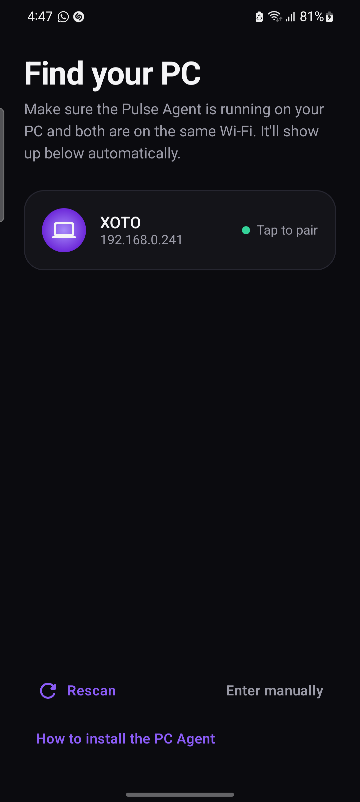
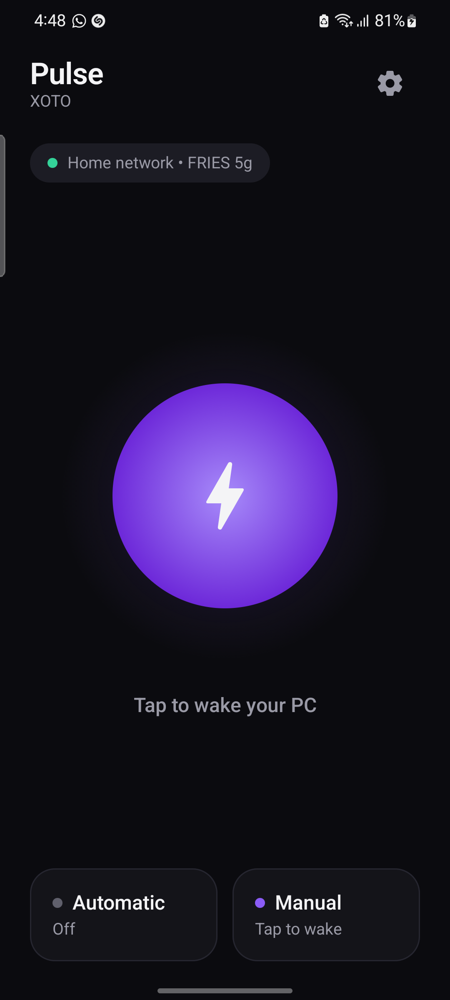
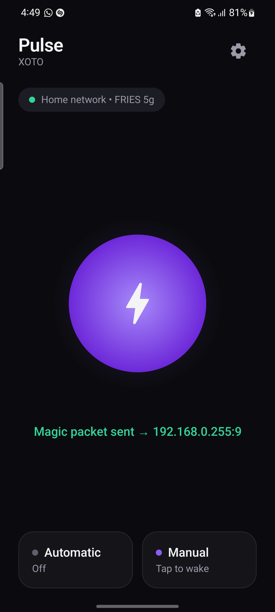

<div align="center">

# ⚡ Pulse

**Wake your Windows PC from your Android phone — automatically when you get home, or with a single tap.**

Zero-config Wake-on-LAN over your local network, wrapped in a premium dark UI.


</div>

---

## 📸 Screenshots

| Find your PC | Wake screen | Wake sent |
|:---:|:---:|:---:|
|  |  |  |

---

## ✨ Features

- **🔍 Zero-config discovery** — install a tiny agent on your PC and it shows up in the app by name. No typing MAC addresses, IPs, or broadcast addresses.
- **👆 Manual wake** — one tap on the wake orb powers on your PC from anywhere on your Wi-Fi.
- **🏠 Automatic mode** — the app wakes your PC the moment your phone joins your home Wi-Fi, in the background, with no interaction.
- **✅ Wake verification** — after a wake, the app checks whether the PC actually came online and tells you.
- **🧠 Reliability built-in** — skips the wake if the PC is already on, debounces brief Wi-Fi drops, retries the magic packet, and survives app-close and reboots.
- **🎨 Premium UI** — dark theme, purple accent, rounded cards, spring animations. Built with Jetpack Compose.
- **🧩 Modular by design** — a pluggable automation layer makes it easy to add shutdown, notifications, etc. later.

---

## 🧱 Repository structure

```
Pulse/
├── android/                 # The Pulse Android app (Kotlin + Jetpack Compose)
│   └── app/src/main/java/com/wolcompanion/app/
│       ├── core/            # wol (magic packet), net (Wi-Fi monitor, reachability), discovery
│       ├── data/            # SettingsRepository (DataStore) + models
│       ├── automation/      # pluggable Automation interface + auto-wake
│       ├── service/         # foreground service + boot receiver (Automatic mode)
│       └── ui/              # Compose screens, theme, ViewModel
├── pc-agent/                # LAN discovery beacon (Windows PowerShell)
│   ├── PulseAgent.ps1        #   broadcasts this PC's identity so the app can find it
│   └── Install-PulseAgent.ps1#   auto-start at logon (no admin)
├── pc-setup/                # One-time Wake-on-LAN setup helper (Windows PowerShell)
│   └── Setup-WoL.ps1
├── docs/screenshots/
├── LICENSE
└── README.md
```

---

## 🏗️ Architecture overview

Pulse is three cooperating pieces on one local network:

```
┌─────────────────────┐        UDP beacon (:42999)        ┌──────────────────────┐
│   PC Agent (PS1)     │  ───────────────────────────────▶ │   Android app        │
│   broadcasts name,   │                                    │   "Find your PC"     │
│   MAC, IP, broadcast │                                    │   discovers & pairs  │
└─────────────────────┘                                    └──────────┬───────────┘
                                                                       │
                        magic packet (UDP :9, broadcast)               ▼
┌─────────────────────┐  ◀───────────────────────────────  ┌──────────────────────┐
│  PC network card     │        0xFF×6 + MAC×16             │  Manual tap  /        │
│  (wakes from S3/S5)  │                                    │  Auto on home Wi-Fi   │
└─────────────────────┘                                    └──────────────────────┘
```

**Android app layering** (`core → data → automation → service → ui`):

- **`core/wol`** — builds and sends the Wake-on-LAN magic packet (`0xFF`×6 + MAC×16) as a UDP broadcast to the subnet's directed-broadcast on port 9, repeated for reliability.
- **`core/net`** — a `NetworkMonitor` wrapping `ConnectivityManager` (Wi-Fi state + SSID) and a TCP `PcReachability` probe for "is it awake?".
- **`core/discovery`** — listens for PC Agent beacons (UDP 42999) and returns discovered PCs.
- **`data`** — `SettingsRepository` backed by Jetpack **DataStore**; settings persist after first pairing.
- **`automation`** — an `Automation` interface + registry. `AutoWakeAutomation` is the first implementation; add new automations without touching the service loop.
- **`service`** — a foreground `AutoWakeService` holding a `NetworkCallback` (powers Automatic mode) and a `BootReceiver` to resume after reboot.
- **`ui`** — Jetpack Compose screens, a single dark/purple theme, and one `WolViewModel`.

**Why Android (not iOS):** only Android can run a background service that fires on a Wi-Fi transition and send a UDP magic packet unattended. iOS forbids both, so true hands-free auto-wake isn't possible there.

---

## 🚀 Getting started

### Prerequisites

- A **Windows 10/11 PC** with a wired Ethernet connection (strongly recommended — most Wi-Fi cards can't wake from full shutdown).
- An **Android 8.0+** phone.
- Phone and PC on the **same local network**.
- To build the app: **Android Studio** (Giraffe or newer) — it bundles the JDK and Android SDK.

### Part 1 — Prepare the PC (one time)

1. **Enable Wake-on-LAN in BIOS/UEFI.** Reboot into BIOS (usually `Del` or `F2`) and set:
   - `Wake on LAN` / `Power On By PCIE` → **Enabled**
   - `ErP Ready` / `Deep Sleep` → **Disabled** (this one commonly blocks wake-from-full-shutdown)
2. **Run the setup helper** (elevated PowerShell) to configure Windows automatically:
   ```powershell
   cd pc-setup
   powershell -ExecutionPolicy Bypass -File .\Setup-WoL.ps1
   ```
   It enables "Wake on Magic Packet", disables Fast Startup, and prints your PC's details. Use `-ReportOnly` to inspect without changing anything.
3. **Install the discovery agent** so the app can find your PC by name:
   ```powershell
   cd ..\pc-agent
   powershell -ExecutionPolicy Bypass -File .\Install-PulseAgent.ps1
   ```
   This starts a hidden background beacon and sets it to auto-start at logon (no admin needed). Remove it any time with `-Uninstall`.

### Part 2 — Build & install the app

**Option A — Android Studio (recommended)**
1. Open the `android/` folder in Android Studio and let it sync (it fetches the SDK and dependencies).
2. Connect your phone (enable **Developer Options → USB debugging**) or start an emulator.
3. Press **▶ Run**.

**Option B — command line**
```bash
cd android
# with the Android SDK installed and JAVA_HOME set to a JDK 17
gradle :app:assembleDebug          # or ./gradlew if the wrapper is present
adb install -r app/build/outputs/apk/debug/app-debug.apk
```

### Part 3 — Pair & use

1. Open Pulse. On **"Find your PC"**, your PC appears automatically — **tap to pair**. (Grant **Location** when asked; Android needs it to read the Wi-Fi name for Automatic mode.)
2. You land on the home screen. **Tap the orb** to wake your PC.
3. Open **Settings → Test wake** to confirm end-to-end, then flip on **Automatic mode**.

Your settings are saved automatically — you never re-enter them.

---

## 📖 Usage

| Action | How |
|---|---|
| **Wake now** | Tap the purple orb on the home screen. |
| **Test wake** | Settings → Test wake — sends the packet, then verifies the PC came online. |
| **Automatic mode** | Settings → toggle on. Pulse wakes the PC whenever you join your home Wi-Fi. |
| **Re-pair / change PC** | Settings → edit, or "Find your PC" again. |
| **Manual setup** | On "Find your PC", tap **Enter manually** if you prefer to type details. |

---

## 🔧 Troubleshooting

| Symptom | Fix |
|---|---|
| PC doesn't wake from **full shutdown** | BIOS: disable **ErP/Deep Sleep**, enable **Power On By PCIE**. Wake-from-sleep working but shutdown not = this is the cause. |
| PC **randomly wakes** from sleep | In the NIC's Power Management, enable **"Only allow a magic packet to wake"** (disables pattern-match wake). `Setup-WoL.ps1` guidance covers this. |
| App **can't find the PC** | Ensure the Pulse Agent is running (`Install-PulseAgent.ps1`) and both devices are on the same Wi-Fi/subnet. Tap **Rescan**. |
| Wrong IP discovered | The agent picks the real LAN NIC (excludes USB-tethering/VPN/virtual adapters). Unplug USB tethering if active, or use **Enter manually**. |
| Automatic mode not firing | Grant **Location** permission and keep it set to "Allow all the time"; confirm the saved home SSID matches. |

---

## 🔒 Security & privacy

- The PC Agent **only broadcasts outward** (name, MAC, local IP) on your LAN — it opens **no inbound ports** and makes **no internet connections**.
- Wake-on-LAN only **powers a machine on**; it grants no access to files or the desktop.
- Discovery is unauthenticated by design (LAN trust model). Use on trusted networks; avoid running the agent on public Wi-Fi.
- Remove the agent completely with `Install-PulseAgent.ps1 -Uninstall`.

---

## 🗺️ Scope

Local-network wake only. Remote-over-internet wake is intentionally out of scope. The modular automation layer is designed so features like remote wake, shutdown, and notifications can be added later.

---

## 📄 License

[MIT](LICENSE) © 2026 TasinZX
